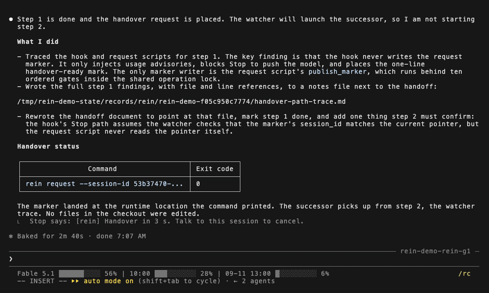

<h1 align="center">claude-rein</h1>

<p align="center">
  <em>Nothing lasts. Reincarnate.</em>
</p>

<p align="center">
  
  
  
</p>

**A long task shouldn't have to run on one tired Claude Code session, or stop at the context window. You don't have to
be around for the switch.**

Run `rein up` instead of `claude`. Nothing else about the way you work changes.

Before a session gets there, rein has it write a letter about where it got to, starts a fresh session on that letter,
and repoints your terminal. Nothing else survives the switch.

<p align="center">
  
</p>
<p align="center"><sub>Recorded against a 200K context window, with the cancel window shortened from its default 10 seconds to 3. Everything else is at its default.</sub></p>

One line is all you ever see:

```
[rein] Handover in 10 s. Talk to this session to cancel.
```

Say something and it's canceled. Say nothing and you come back to a session that never got old.

## Why bother

Claude Code will keep working while you eat, while you shower, while you sleep. Give it a clear goal and it doesn't need
you in the room.

**What it can't do is stay sharp.** A session that's been open all day drags the whole day into every answer, and it
runs out of room in the end too. Compaction only buys room: it replaces your history with a summary, written mid-task,
about whatever it judged worth keeping. The real fix is a fresh session, started at a moment someone picked, on a letter
someone meant to write. That someone is you, and you have to be awake for it.

rein is that someone.

## How it works

**rein never reads your conversation. It reads one number: how full the context window is.** Claude Code's own
statusLine writes that number down every turn, which is why switching it on is the last step of the setup below.

Past the threshold, nothing is interrupted. rein tells the session to hand over at its next natural break, and the
session picks the moment: it finishes the turn, waits out any subagent still running, writes the letter through to the
end, and only then asks for the switch. That request is the ten seconds above. The successor is up and running before
your terminal moves over to it, and the session you were talking to is stopped after that.

## Requirements

- macOS
- `jq`, which recent macOS ships at `/usr/bin/jq`; on an older one, `brew install jq`
- The Claude Code CLI (`claude`) on your PATH

Everything else rein calls, macOS itself ships.

<details>
<summary><code>rein doctor</code> says <code>date</code> or <code>stat</code> doesn't work</summary>

rein calls these commands the way Apple's versions take their flags. What trips this is GNU coreutils sitting ahead of
`/usr/bin` on your PATH, which is what `brew install coreutils` does when its `gnubin` directory goes at the front.
Nothing is missing. Move `gnubin` behind `/usr/bin` and run `rein doctor` again.

</details>

## Quick start

Four steps. The last one is what actually arms it.

### 1. Clone

```sh
git clone https://github.com/shasyasan/claude-rein.git ~/claude-rein
```

Pick a location you won't move afterwards: step 3 records this path. The rest of this README assumes `~/claude-rein`.

### 2. Put `~/.local/bin` on your PATH

Skip this if it's already there.

```sh
echo 'export PATH="$HOME/.local/bin:$PATH"' >> ~/.zshrc
source ~/.zshrc
```

Not zsh? Same line, your shell's own rc file.

### 3. Initialize

```sh
cd ~/claude-rein
bin/rein --cwd <target project> init
```

`rein` isn't on your PATH yet, so call it by path. `<target project>` is the project you want rein to watch. This places
the `rein` symlink in `~/.local/bin`, registers the plugin with Claude Code, lays down the handoff template, and ends by
running `rein doctor`.

### 4. Turn on context-usage recording

**Nothing works without this step.** Skip it and usage never gets recorded, so a handover never fires.

`rein doctor` prints a paste-ready statusLine snippet. Put it in `~/.claude/settings.json`, then start a Claude Code
session once and let it take a turn. Nothing is recorded until a session runs with the statusLine in place, so that
first turn is what creates the record. Run `rein doctor` again afterwards and confirm usage is being recorded.

<details>
<summary>If you already run your own statusLine</summary>

Don't replace it. Call `rein-statusline.sh` from inside it. Capture the JSON your statusLine receives on stdin, pipe
that same JSON to `rein-statusline.sh`, and discard its stdout.

```sh
#!/usr/bin/env bash
input=$(cat)
printf '%s' "$input" | "$HOME/claude-rein/scripts/rein-statusline.sh" >/dev/null

# build your own display from "$input"
printf '%s\n' "$(printf '%s' "$input" | jq -r '.model.display_name')"
```

`rein doctor` accepts any statusLine that records usage this way, so it doesn't have to be the one bundled with rein.

</details>

### That's it

`rein up`, then use Claude Code the way you always do.

> [!WARNING]
> Don't type once the switch is under way. Both sessions are briefly live in the same directory, and your terminal is
still showing the one being retired. That normally lasts 15 to 80 seconds after the notice; `rein status` tells you when
the window has closed.

## Commands

Run these from the target project's directory.

One continuous run of rein against a single project is a **lineage**: `rein up` starts one, `rein down` ends it. Run
rein in as many projects as you like. Each keeps its own lineage, and they don't interfere.

| Command                  | What it does                                                                               |
|--------------------------|--------------------------------------------------------------------------------------------|
| `rein up`                | Start everything and drop you straight into the Claude session                             |
| `rein down`              | Shut it all down                                                                           |
| `rein status`            | Print the current state, including where the handoff document is                           |
| `rein attach`            | Give a lineage its terminal back after you closed it; it follows every handover from there |
| `rein doctor`            | Check dependencies and installation                                                        |
| `rein snooze <duration>` | Postpone automatic handover (e.g. `30m`)                                                   |
| `rein config`            | Read and write settings (see below)                                                        |
| `rein prune`             | List cleanup candidates (deletes only with `--force`)                                      |

`rein --help` lists the rest. If something isn't working, start with `rein doctor`.

## Configuration

`rein config list` prints every key along with a description.

```sh
rein config list
rein config get threshold_handover
rein config set threshold_handover 25
rein config unset threshold_handover
```

**The two most people touch are `threshold_notice` and `threshold_handover`**, the context-usage percentages that decide
when a handover happens, default 30 and 40. A handover doesn't arrive all at once. At `threshold_notice` the session
first gets told to start thinking about a good place to stop; at `threshold_handover` it gets told to finish up and hand
over. Move them together: raise them to run a session closer to full, lower them to switch earlier and more often. Every
switch costs a document to write and a document to read, so set them too low and the sessions spend their time
introducing themselves to each other.

<details>
<summary>Why there are two of them</summary>

One instruction that arrives only at the end comes too late: a session told to hand over right now has no room left to
write the document properly, and the document is the whole handover. One soft nudge is too easy to lose: a session that
can't stop at that moment goes back to work, and by the time it could stop, the nudge is buried under everything that
came after. So the first one is soft and early, and the second one is firm.

Neither one is an order. Both say the same thing: your own instructions come first, finishing a nearly-done piece of
work beats a modest overrun, and the handoff document gets written properly either way. What changes between them is how
hard the session is pushed. Past `threshold_handover`, the end of a turn is held once so the decision can't be walked
past, and only once, so a session that has already decided isn't stopped again.

</details>

## The letter

**The handoff document is the handover. Everything else is plumbing.**

You never write it. Claude does. `rein init` puts a template in your project, and the session keeps it current at every
boundary it reaches, not in the last ten seconds. When the switch comes, the retired session is stopped, and nothing of
it reaches the successor except what the letter says.

Four sections, and only these four:

```markdown
## Where things stand
## Next steps
## In flight at handover
## Standing decisions
```

- **Where things stand.** What is open right now, and where each piece of work keeps its own notes. Not what got
  finished: by the time anyone reads this, that's gone.
- **Next steps.** What to do next, and which items have to be checked with a parallel session before they move.
- **In flight at handover.** The subagents and jobs that were running. They die with the session, so the successor knows
  what to restart.
- **Standing decisions.** Rulings that still bind the work being handed over, quoted, each one naming what has to finish
  before it lapses.

**A handover is refused if a section is missing or a new one has been added.** A section, once in, gets copied forward
at every handover and never leaves until someone deletes it by hand. The letter is a working record, not a permanent
one: it carries the work across the switch and no further. Where your project already has a home for permanent rules and
procedures, the session is told to write them there instead.

## Update

Run `rein down` in every project you have rein running in, then:

```sh
git -C ~/claude-rein pull
```

Then `rein up` again in each.

## Uninstall

Run these from the target project's directory, in this order. Nothing here deletes a file until step 4, and step 4 needs
paths only `rein` itself can print. That's why you ask before you remove the command.

### 1. Print where your files are

```sh
rein status
rein config get usage_state_dir
```

Both print resolved locations even when you've configured nothing: `status` gives you the `records:`, `handoff:` and
`runtime:` lines, `config get` gives you where the usage records are written.

### 2. Remove the command and the plugin

```sh
rein down
claude plugin uninstall rein@claude-rein
claude plugin marketplace remove claude-rein
rm ~/.local/bin/rein
```

The `rm` removes the symlink that step 3 of the quick start placed.

### 3. Undo step 4 of the quick start

If rein's statusLine is the only one you have, remove it:

```sh
CFG=~/.claude/settings.json
OUT=$(jq 'del(.statusLine)' "$CFG") && printf '%s\n' "$OUT" > "$CFG"
```

It writes back into the file rather than replacing it, so a `settings.json` symlinked from a dotfiles repository
survives. If `jq` fails, nothing is written. If you call `rein-statusline.sh` from a statusLine of your own, delete just
that line instead. The snippet above would take yours down with rein's.

### 4. Delete what's left on disk

Nothing above removes any of this. The paths are the defaults; substitute whatever step 1 printed.

```sh
rm -rf <target project>/.rein                        # handover history, and the handoff document
rm -rf "${XDG_STATE_HOME:-$HOME/.local/state}/rein"  # runtime data for every lineage, and the hooks' fire log
rm -rf "${XDG_CONFIG_HOME:-$HOME/.config}/rein"      # your settings, and the record of allowed project settings
rm -rf ~/.claude/state/context-usage                 # the usage records the statusLine wrote
rm -rf ~/.claude/plugins/cache/claude-rein           # the plugin cache, which uninstalling leaves behind
```

Only the first line is per-project. Everything below it covers every project at once. If you moved the state directory,
step 1's `runtime:` line names only that one lineage's subdirectory, and the fire log sits one level above it. If you
moved your settings with `--config` or `--root`, delete the path you passed instead of the `rein` directory under your
config home.

## What rein leaves alone

- **It never writes to your `~/.claude/settings.json`.** Step 4 of the quick start is yours to make, and it stays yours.
  `rein doctor` reads that file back to check it; nothing in rein ever edits it.
- **A plain `claude` you start yourself is left alone**, even in the same directory. rein's hooks act only on the
  sessions rein launched, so nothing gets injected and no handover fires.
- **Claude Code's own `claude attach` goes around it.** rein keeps one terminal per lineage, but a terminal attached
  with the base command isn't something rein can see, let alone refuse. It dies with the session at the next handover.
  If you've lost your terminal, `rein attach` gives you one that follows the handovers.
